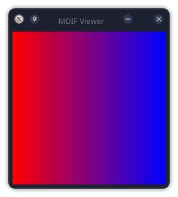

# MDIF (Minimal Data Image Format)


[](https://github.com/nthnn/mdif/blob/main/LICENSE)

MDIF (Minimal Data Image Format) is a simple and efficient image format designed for use with Diwa, a lightweight implementation of Artificial Neural Networks. MDIF is optimized for environments with limited resources, such as microcontrollers with (specially MCUs with PSRAM), but it is also suitable for desktop environments.

<p align="center">
    
</p>

<p align="center">
    <i>MDIF viewer showing the generated gradient image.</i>
</p>

MDIF is designed to have a minimalistic image data structure that balances simplicity for functionality. It provides essential image handling capabilities while being lightweight enough to be used in resource-constrained environments. The primary use case for MDIF is with Diwa, a neural network library that supports various platforms.

## Features

- **Minimal and Efficient Data Structure**

    MDIF is designed with a focus on minimalism and efficiency. The data structure is intentionally simple, consisting of a signature for format identification, dimensions for width and height, and separate pointers for red, blue, green, and alpha color channels. This structure minimizes overhead and ensures that the image data can be processed quickly and easily, even in environments with limited resources.

- **Support for RGBA Color Model**

    MDIF supports the RGBA (Red, Green, Blue, Alpha) color model, which provides a comprehensive way to represent color images. The separate channels for red, green, blue, and alpha allow for detailed manipulation of image data, including transparency handling via the alpha channel.

- **Tools for Converting Between MDIF and Popular Image Formats (PNG, JPG)**

    MDIF includes tools for converting between MDIF and popular image formats such as PNG and JPG. These tools enable users to easily convert images to MDIF for efficient storage and processing, and then convert them back to standard formats for display or distribution.

- **Viewing Tools for Both Windows and Linux**

    MDIF comes with viewing tools that allow users to display MDIF images on both Windows and Linux platforms. These tools provide a straightforward way to visualize MDIF images, ensuring that users can quickly verify the contents of their image files.

## Data Structure

The `mdif_t` (a.k.a `mdif_struct`) is defined as follows:

```c
typedef struct mdif_struct {
    char signature[2];

    short width;
    short height;

    unsigned char *red;
    unsigned char *blue;
    unsigned char *green;
    unsigned char *alpha;
} mdif_t;
```

- **signature**: A 2-byte signature that identifies the file as an MDIF file. (Equivalent to string "NT")
- **width**: The width of the image in pixels (from 1 to 1024).
- **height**: The height of the image in pixels (from 1 to 1024).
- **red, blue, green, alpha**: Pointers to the image's color and alpha channel data. Each channel is stored as a separate array of bytes, allowing for efficient access and manipulation.

## Limitations

- **Maximum Image Dimensions**: The MDIF implementation restricts image width and height to a maximum of 1024 pixels (and minimum of 1 pixel). This limitation might be too restrictive for high-resolution images. However, this limitation is due to its intention for [Diwa](https://github.com/nthnn/diwa) ML/AI integration.

- **Single-Threaded**: The implementation is single-threaded and does not take advantage of multi-core processors, which could enhance performance, especially for large images or batch processing.

- **Memory Allocation**: The MDIF library uses dynamic memory allocation for the red, green, blue, and alpha channels. On devices like the Raspberry Pi Pico, which has more limited RAM, this can lead to allocation failures, particularly for images larger than 512x512 pixels. However, on ESP32 microcontrollers with PSRAM, this limitation is less critical due to their larger dynamic memory capacity.

- **No Compression**: MDIF does not include any form of image compression, leading to larger file sizes compared to formats like PNG or JPG.

- **No Metadata Support**: MDIF does not support storing additional metadata (e.g., image description, author information, or creation date), which might be useful for some applications.

- **No Color Management**: The implementation does not support color profiles or any form of color management, which might be necessary for accurate color representation across different devices.

## Building Tools from Source

### Linux

To build MDIF tools on Ubuntu from source, simply follow the steps below:

1. **Clone Repository**: Clone the the MDIF repository from GitHub to get the source files on your local machine.

    ```shell
    git clone https://github.com/nthnn/mdif --depth 1
    ```

2. **Build from Source**: Build the MDIF tools from source by executing the terminal commands below:

    ```shell
    cd mdif # Move to the mdif repository directory

    # Install library dependencies
    sudo apt install libpng-dev libjpeg-dev qtmultimedia5-dev qtcreator

    # Build the MDIF tools
    sudo chmod +x ./build.sh
    ./build.sh
    ```

3. **Install the package**: After successfully building the MDIF tools from source, you can now install the output `*.deb` package via `dpkg`:

    ```shell
    sudo dpkg -i dist/mdif_*.deb
    ```

4. **Using the tools**: You can now use the tools after installing the `*.deb` package. The following tools included are:

    - `mdif_jpg` - Tool for converting MDIF to JPG and vice versa
    - `mdif_png` - Tool for converting MDIF to PNG and vice versa
    - `mdif_viewer` - GUI program for viewing MDIF files (tested on KDE Plasma 5)

### Windows

To build on Windows system, follow the steps below:

1. **Clone Repository**: Clone the the MDIF repository from GitHub to get the source files on your local machine.

    ```shell
    git clone https://github.com/nthnn/mdif --depth 1
    ```

2. **Install Dependencies**: Install the dependencies and prerequesites on your system.

    - **GNU/GCC** - The GNU Compiler Collection is a collection of compilers from the GNU Project that support various programming languages, hardware architectures and operating systems.
    - **[libpng](https://gnuwin32.sourceforge.net/packages/libpng.htm)** - The libpng package contains a library of functions for creating and manipulating PNG (Portable Network Graphics) image format files. PNG is a bit-mapped graphics format similar to the GIF format. PNG was created to replace the GIF format, since GIF uses a patented data compression algorithm.
    - **[libjpeg](https://gnuwin32.sourceforge.net/packages/jpeg.htm)** - This package contains C software to implement JPEG image compression and decompression. JPEG is a standardized compression method for full-color and gray-scale images. JPEG is intended for "real-world" scenes; cartoons and other non-realistic images are not its strong suit. JPEG is lossy, meaning that the output image is not identical to the input image. The user can trade off output image quality against compressed file size by adjusting a compression parameter.

3. **Build from Source**: Simply run the `build-win.bat` batch file from the repository folder to build all the MDIF tools.

4. **Using the tools**: After successfully building from source, the following programs will be available on the `dist` folder.

    - `mdif_jpg.exe` - Tool for converting MDIF to JPG and vice versa
    - `mdif_png.exe` - Tool for converting MDIF to PNG and vice versa
    - `mdif_viewer.exe` - GUI program for viewing MDIF files (tested on KDE Plasma 5)

## License

```
Copyright 2024 Nathanne Isip

Licensed under the Apache License, Version 2.0 (the "License");
you may not use this file except in compliance with the License.
You may obtain a copy of the License at

    http://www.apache.org/licenses/LICENSE-2.0

Unless required by applicable law or agreed to in writing, software
distributed under the License is distributed on an "AS IS" BASIS,
WITHOUT WARRANTIES OR CONDITIONS OF ANY KIND, either express or implied.
See the License for the specific language governing permissions and
limitations under the License.
```